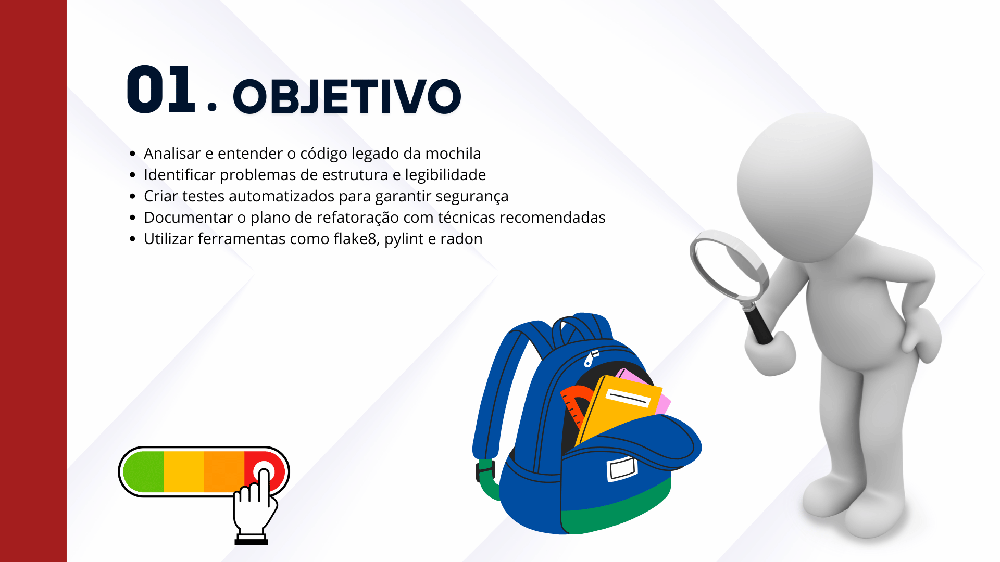
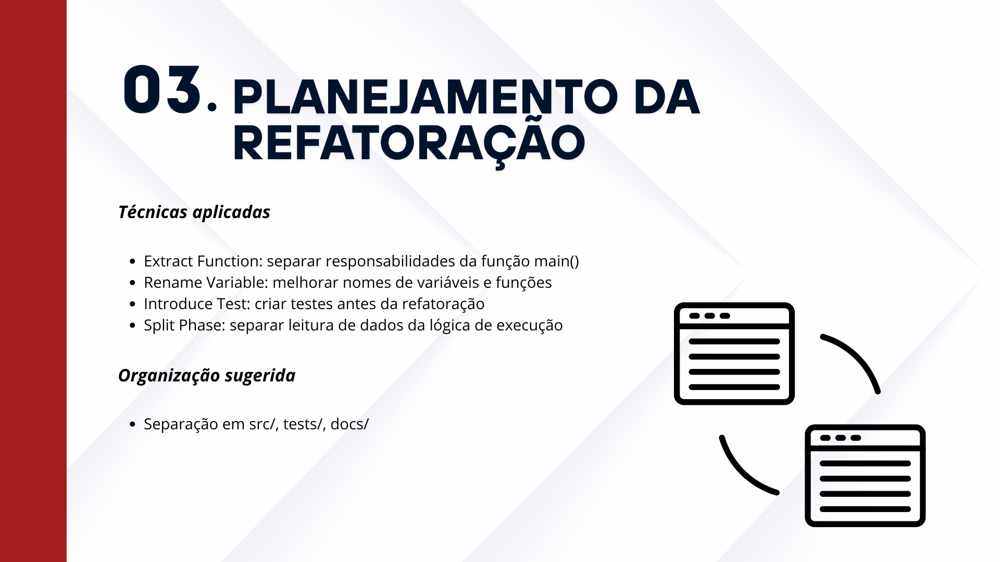
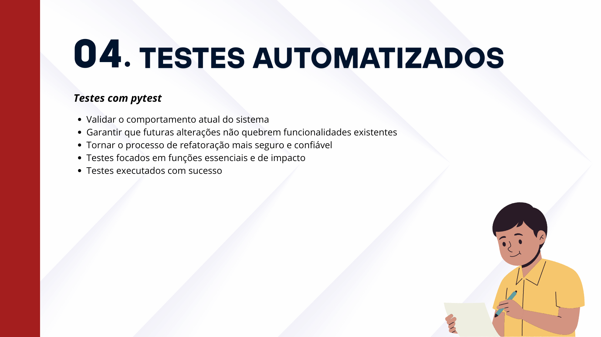
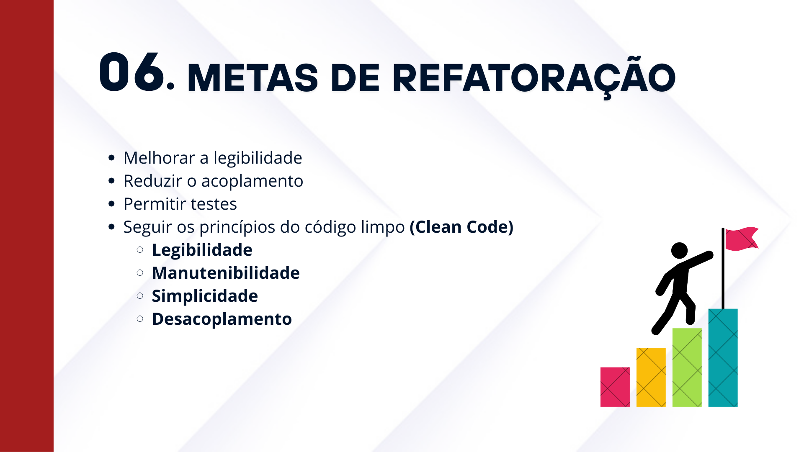
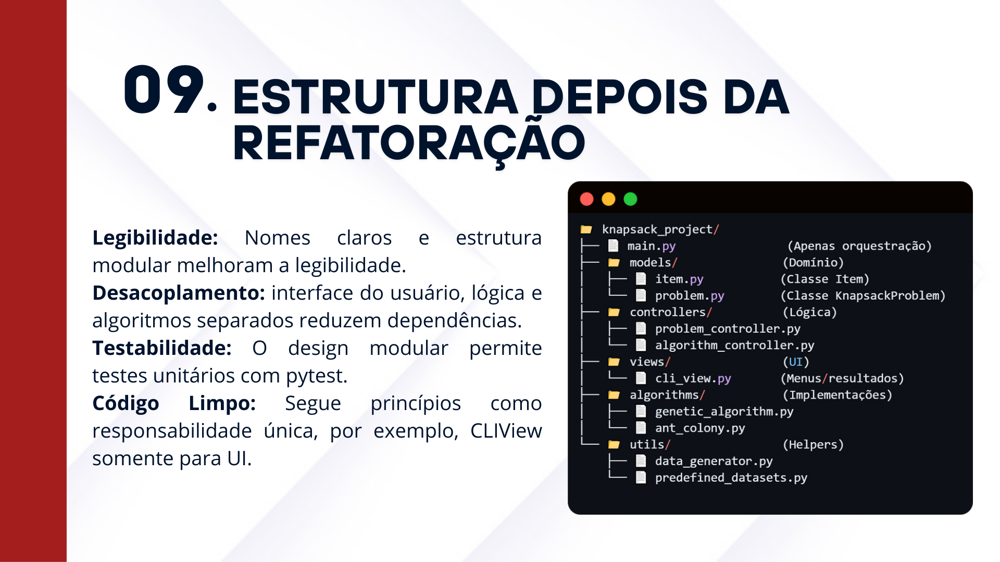
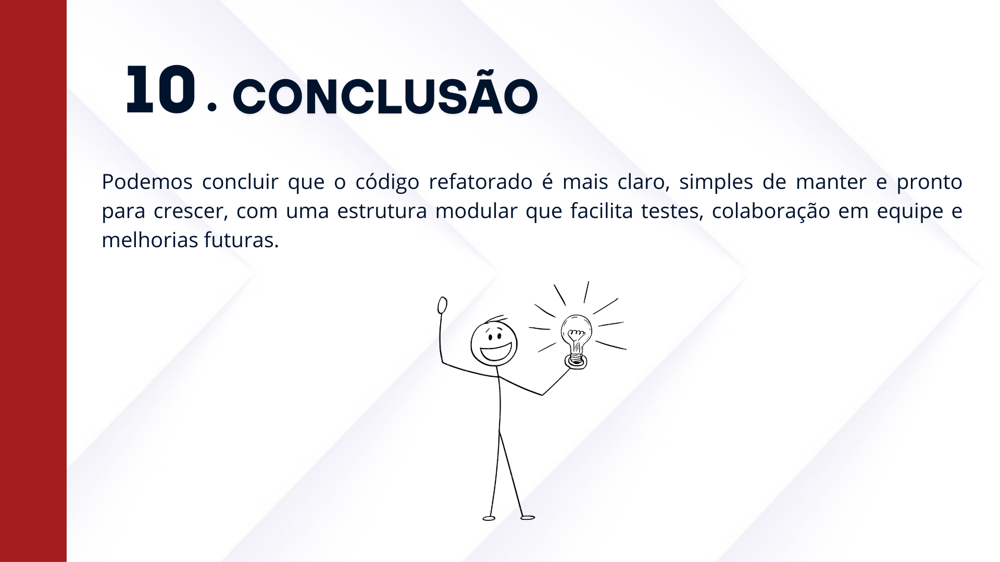

# Slides da Apresentação - Refatoração do Problema da Mochila

## 📂 Visualização dos Slides

As imagens abaixo foram exportadas diretamente do Canva e representam as etapas desenvolvidas nesta refatoração.

### Slide 1 - Capa

### Slide 2 - Objetivo

### Slide 3 - Análise do Código Original

### Slide 4 - Planejamento da Refatoração

### Slide 5 - Testes Automatizados

### Slide 6 - Análise de Qualidade - Antes da Refatoração

### Slide 7 - Metas de refatoração

### Slide 8 - Estrutura antes da refatoração

### Slide 9 - Técnicas utilizadas

### Slide 10 - Estrutura depois da refatoração

### Slide 11 - Conclusão

